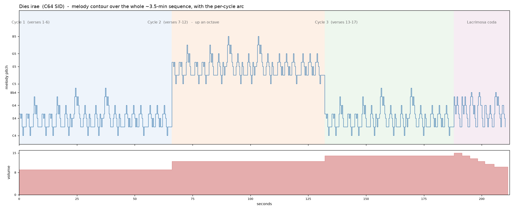

# Dies Irae on the Commodore 64 SID

A faithful rendition of the complete medieval *Dies irae* plainchant — all ~19 stanzas
— played on the Commodore 64's SID sound chip, written from scratch in 6502 assembly
(`dies-irae.asm`).

The goal was twofold: **get the notes exactly right** (the actual liturgical chant, not the
loose motif pop culture quotes), and **make it sound like music** on a 1982 sound chip rather
than a beep test. This document explains how both were done.

- **Source:** [`dies-irae.asm`](dies-irae.asm) (ACME assembler, PAL C64)
- **Audio:** [`dies-irae.wav`](dies-irae.wav) (~3:33, the full shaped render)
- **Visual score:** [`dies-irae-pianoroll.png`](dies-irae-pianoroll.png) (below)

---

## 1. The chant

The *Dies irae* ("Day of Wrath") is a 13th-century Gregorian sequence in **Mode 1 (Dorian),
with its final on D**. Dorian is almost a minor scale but with no raised leading tone, which
gives the chant its sombre, archaic colour.

It has **17 three-line verses followed by the *Lacrimosa* coda** (the *Lacrimosa … Pie Jesu …
dona eis requiem, Amen* ending). A "sequence" is a special chant form that **reuses a handful
of melodies** across many verses in an **AABBCC** pattern — so the whole thing is built from
just **three verse-melodies plus the coda**:

| Melody | Verses | Character |
|--------|--------|-----------|
| **A** | 1–2, 7–8, 13–14 | syllabic, low; the **iconic theme** — `F F E F D C D D` / `F F E F D C D D` / `F A G F G E D D` |
| **B** | 3–4, 9–10, 15–16 | **melismatic**, arches up to a **B-natural** (the Dorian 6th), 2–3 notes per syllable on its descents |
| **C** | 5–6, 11–12, 17 | low, plain recitation, peaking only at **G** (a 4th above the final); verse 17 is an unpaired hinge |
| **D** | *Lacrimosa* coda | **through-composed**, played once; introduces **B-flat** (the ♭6) where the verses sang B-natural; ends in a long melismatic *Amen* falling to D |

Full performance order: **`A A B B C C  A A B B C C  A A B B C  D`**.

All four melodies rest on the final D and together span C up to B. The only chromatic colour
is the **sixth degree** — bright and natural in melody B, dark and flattened in the *Lacrimosa*.

---

## 2. Faithfulness: transcribing from the manuscript

The "Dies Irae" most people recognise (from Berlioz, Rachmaninoff, and a hundred film scores)
is a **loosened paraphrase** of the opening motif. To get the *real* chant, every melody was
transcribed **note-for-note from the manuscript** (the *Parish Book of Chant* / *Liber
Usualis*), not from memory or the popular version.

### The transcription pipeline

1. **Read the neumes.** A page of square-note (neume) notation was given to a vision model with
   a structured prompt asking for, per verse:
   - the **clef** (a C-clef on the 4th line → the bottom staff line is D);
   - any **flat signs** (B-flat vs B-natural — the one accidental chant uses);
   - **syllable → note**, left to right;
   - the result expressed as **scale degrees relative to the modal final D** (`1 = D`), which
     is unambiguous and transposition-proof.
2. **Handle melisms.** Later verses aren't purely syllabic — a single syllable can carry a
   2–3 note **neume** (podatus, clivis, torculus). Each neume note is transcribed in order and
   becomes its own note in the sequencer; a melisma is simply more consecutive notes.
3. **Map the form.** The vision model also confirmed the **AABBCC repetition scheme** and where
   it breaks (after verse 17, into the *Lacrimosa*), so the later verses reuse already-verified
   melodies rather than being re-transcribed.

### Independent verification of each melody

After implementing each melody, it was checked by an **independent blind transcription**: a
listening model was given the rendered audio *without* being told the expected notes, and asked
to transcribe what it heard. Each melody came back matching note-for-note — including melody B's
**B-natural peak**, melody D's **B-flat**, and every melisma grouping.

> **A note on trust.** The listening model proved **unreliable for timbre and for fine details**
> — at one point it described the triangle wave as a "square wave," and it once "heard" a note in
> the *Lacrimosa* that provably wasn't in the audio (it had pattern-matched a repeat). Those were
> caught against **ground truth** (see [§7 Verification](#7-verification)), not taken on faith.
> Accuracy was never decided by ear — it was decided by the manuscript and the chip's registers.

---

## 3. Rendering on the SID

The C64's SID chip (6581/8580) has **three independent voices**. They are used as:

| Voice | Role | Waveform |
|-------|------|----------|
| 1 | the **melody** | low-pass-filtered **triangle** |
| 2 | **D2 drone** (73.4 Hz) | triangle |
| 3 | **A2 drone** (110 Hz) | triangle |

### The melody voice — making a SID sound "sung"

A raw SID waveform sounds buzzy and electronic. To get as close to a soft, vocal/organ tone as a
1982 chip allows:

- **Triangle wave** (`$11` gate-on / `$10` gate-off) — the softest, purest SID waveform.
- **Low-pass filter** on voice 1 only — cutoff `$D416 = $40`, light resonance, routed via
  `$D417 = $11`, mode `$D418` bit 4 — rounding off the remaining harshness.
- **A gentle envelope** — `AD = $3A` (attack rate 3, ≈ 24 ms, so notes *bloom* rather than click;
  decay 10) and `SR = $DA` (sustain 13, release 10, so each note tapers). Each note is held, then
  the gate is dropped a few frames early, so the next note's `0→1` gate edge re-triggers the attack.

### The drone — medieval organum

Voices 2 and 3 hold a **sustained open fifth, D–A**, the modal final and its fifth. This is the
**organum pedal** of early medieval polyphony — a low, unchanging drone that grounds the mode and
gives the piece its ominous, liturgical weight. The drones use a slightly lower sustain (`SR = $BA`)
so they sit *under* the melody rather than competing with it.

### Note frequencies

SID frequency registers are set from real pitches with the PAL formula:

```
reg = round( Hz × 16777216 / 985248 )
```

The full pitch set (Dorian on D, plus both forms of the sixth):

| Note | C4 | D4 | E4 | F4 | G4 | A4 | B4 (♮) | B♭4 |
|------|----|----|----|----|----|----|--------|-----|
| reg  | `$1167` | `$1389` | `$15ED` | `$173B` | `$1A13` | `$1D45` | `$20DA` | `$1F02` |

### Timing — no interrupts

Note timing is done by **polling the raster beam**: the code spins until scanline 251 (`$D012`)
to get a steady ~50 Hz (PAL frame) tick, and counts note durations in frames. No raster
interrupts, no KERNAL — the program runs with IRQs masked and drives everything itself. It
auto-runs from a BASIC stub (`SYS 2061`).

---

## 4. Rhythm: the unmetered flow of chant

Real Gregorian chant is **unmetered** — it flows with the natural cadence of the Latin, not on a
strict beat. An early attempt that lengthened "accented" syllables produced a **metrical march**,
which is exactly wrong for chant. So the rhythm is:

- an **even pulse** — every note (syllabic *and* melismatic) gets the same basic length (16 frames,
  ≈ 0.32 s);
- **cadential lengthening** — the final note of each line is stretched (≈ 30 frames; the very last
  note ≈ 46) so phrases relax instead of stopping abruptly;
- **breaths between lines** — a short rest separates each line, the way a choir breathes.

This is the "equalist" reading of chant: a calm, even flow that only eases at the phrase ends.

---

## 5. Shaping the arc: avoiding monotony

17 verses from only three melodies, played straight, get repetitive. In the **sung** chant, the
ever-changing Latin words carry the variety — but **instrumentally those words are gone**, and
each melody would otherwise repeat byte-for-byte.

The fix is **per-cycle variation that changes only register and volume — never a note** — so the
tune stays fully recognisable while the 3½ minutes gain a **shape (an arc)**:

| Section | Verses | Register | Volume |
|---------|--------|----------|--------|
| Cycle 1 | 1–6 | home | **9** (soft, intimate) |
| Cycle 2 | 7–12 | **up an octave** | **12** |
| Cycle 3 | 13–17 | home | **14** (the dramatic verses) |
| *Lacrimosa* | coda | home | **15 → fades** to the *Amen* |

The octave lift is implemented by simply **shifting each frequency value left one bit** at
playback (`asl`/`rol`, i.e. ×2 = one octave). The dynamics are writes to the master-volume
register (`$D418`), with a per-line diminuendo through the coda.

**Why this keeps it recognisable.** A melody's identity lives in its **contour, intervals, and
rhythm** — none of which register or volume touch. Transposing a whole melody up an octave is the
textbook identity-preserving operation (the same tune, just higher). And the famous hook (melody
A's opening) plays **first, in its home register, plainly**, so recognition happens immediately,
before any variation begins.

### The whole piece at a glance



The top panel is the melody pitch over the full ~3.5 minutes (note the **octave lift in Cycle 2**
and the return in Cycle 3); the bottom panel is the **volume arc** (the swell across the cycles
and the diminuendo into the *Amen*).

---

## 6. Code architecture

`dies-irae.asm` is built so each new melody — or a whole new arrangement idea — is a small,
isolated change:

- **A shared engine** — SID setup, the raster-timed sequencer, and the wait/timing routines —
  written once and used by every melody.
- **Per-melody data blocks** (`mA … mD`), each a **note-index table** (0 = rest, `$FF` = end) and a
  parallel **duration table** in frames. Notes index the frequency table.
- **Pointer tables** (`noteLo/noteHi/durLo/durHi`) indexed by **melody number** (0 = A … 3 = D), so
  a melody is stored once even though it's reused for many verses.
- **A playlist** naming melodies in verse order (`A A B B C C …`), which the sequencer walks and
  loops.
- **Arrangement tables** (`plTrans / plVol / plDim`), parallel to the playlist, carrying the
  per-section octave transpose, volume, and diminuendo.
- **A `SOLO` build switch** — set `SOLO` to a melody number to audition that melody alone (plain,
  no arc) for verification; `SOLO = -1` plays the whole shaped sequence.

---

## 7. Verification

Because correctness was never judged by ear, every stage was checked against **objective ground
truth**:

- **Register-level checks (VICE binary monitor).** The emulator was driven headlessly and its SID
  registers read back to confirm the **waveform** (triangle, `$10`), the exact **frequencies**
  (e.g. cycle 2 frequencies are exactly doubled — the octave lift), the **filter/envelope**
  settings, and the **per-section volume**. The sequencer's progress was confirmed by reading the
  playlist index over time (it walks `0 → … → 17` and loops).
- **Binary table extraction.** The assembled `plTrans / plVol / plDim` and the playlist bytes were
  read straight out of the `.prg` and checked against the intended arrangement.
- **Blind listening transcription.** Each melody's *pitches* were independently re-transcribed from
  the rendered audio (see [§2](#2-faithfulness-transcribing-from-the-manuscript)).
- **Visual score (piano-roll).** The melody data and arrangement tables are parsed back out of the
  source and plotted, so the implemented result can be read and checked on the page — which is also
  how the musical decisions (organum vs. variation, the arc shape) were evaluated.

This structural, score-and-register based methodology is what kept the rendition honest even when
the "listening" model was confidently wrong.

---

## 8. Build & run

You need [ACME](https://sourceforge.net/projects/acme-crossass/) and
[VICE](https://vice-emu.sourceforge.io/).

```sh
# assemble (Commodore PRG output)
acme -f cbm -o dies-irae.prg dies-irae.asm

# run in VICE (PAL) — auto-runs via the BASIC stub, or SYS 2061
x64sc dies-irae.prg
```

Or just listen to the rendered [`dies-irae.wav`](dies-irae.wav).

---

## 9. Files

| File | What |
|------|------|
| `dies-irae.asm` | the 6502 source — engine, four melodies, arrangement, fully commented |
| `dies-irae.wav` | the finished ~3:33 render of the complete shaped sequence |
| `dies-irae-pianoroll.png` | the visual score — melody contour + dynamics over the whole piece |
