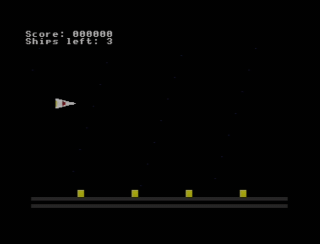

# C64 Horizontal Shoot-'Em-Up

An R-Type-style, horizontally-scrolling shoot-'em-up for the **Commodore 64**, written from
scratch in 6502 assembly. The whole game is a single source file (`scroll.asm`), assembled with
[ACME](https://sourceforge.net/projects/acme-crossass/) and tested in the
[VICE](https://vice-emu.sourceforge.io/) `x64sc` emulator (PAL).

## Gameplay

Pilot a ship through a continuously scrolling starfield, dodging and destroying waves of enemies.
Rack up points, survive enemy fire, and every five kills a multi-part **boss** sweeps in — beat it
for a score bonus and the waves resume.

### Demo



### Controls

| Key | Action |
|-----|--------|
| `I` | Move up |
| `J` | Move left |
| `K` | Move down |
| `L` | Move right |
| `Space` | Fire |

## Features

- **Hardware smooth scrolling** — fine scroll via `$D016` plus a double-buffered coarse-flip, so the
  playfield scrolls pixel-by-pixel with no tearing.
- **Player ship** — keyboard-controlled (IJKL), with rapid fire (Space) and up to 6 bullets on screen.
- **Sprite multiplexer** — a sorted, raster-driven multiplexer drives 15 virtual sprites from the
  C64's 8 hardware sprites (player, player bullets, enemies, enemy bullets).
- **Enemies** — timed waves with multiple movement patterns (straight, sine, zig-zag) that shoot back.
- **Collisions, lives & respawn** — bullet-vs-enemy and enemy-vs-player hit detection, a life system
  with an invulnerable respawn, and a game-over reset.
- **HUD / score panel** — a static two-row status bar (`Score:` and `Ships left:`) held above the
  scrolling playfield by a **raster split**, with a BCD score and custom digit + letter glyphs.
- **Boss** — a five-piece cluster that enters, bobs, fires bullet volleys, has shared HP, flashes when
  hit, and explodes with a bonus on defeat.
- **SID sound effects** — a small per-voice sound engine (frequency sweeps + auto gate-off) playing
  fire, explosion, player-hit, and boss-alert effects.

## Building & running

You need [ACME](https://sourceforge.net/projects/acme-crossass/) and
[VICE](https://vice-emu.sourceforge.io/).

```sh
# assemble (Commodore PRG output)
acme -f cbm -o scroll.prg scroll.asm

# run in VICE (PAL)
x64sc scroll.prg
```

The PRG includes a BASIC stub, so it auto-runs on load (or `SYS 2064`).

**Reading the code:** [`scroll-commented.asm`](scroll-commented.asm) is a line-by-line annotated copy
of `scroll.asm` — identical code (it assembles to the same binary), with every line explained.

## Technical notes

- **Target:** Commodore 64, PAL. Multicolor character mode for the scrolling playfield.
- **Display:** double-buffered screens with `$D018` flipping; color RAM shifted in step with the scroll.
- **Timing:** a stable raster-IRQ chain (`scroll_irq` → `split_irq` → multiplexer → back) does the
  per-frame scroll work, the HUD raster split, and the sprite multiplexing.
- **Memory:** everything lives in VIC bank 0 (`$0000–$3FFF`); buffers, charset, sprites, and the
  runtime data block are hand-placed to avoid the char-ROM shadow and code/buffer overlap.
- **Audio:** SID voices V1/V2/V3 driven by a frame-rate software envelope/sweep player.

Built incrementally in stages (scroll → player → multiplexer → enemies → collisions → HUD → boss →
audio).

## Deep dive: keeping same-scanline sprites visible

The C64 has only **8 hardware sprites**, and at most **8 can appear on any single scanline** — that's
a hard VIC-II limit. A horizontal shooter stresses this badly: when you hold position and fire, every
bullet spawns at the same ship Y and travels along one scanline, so a stream of bullets (plus the ship
and any enemy fire crossing that line) easily piles up on a single row. Early on, bullets would simply
**vanish** under fire. Fixing it turned out to be more subtle than the 8-sprite limit suggests.

The VIC-II only has **8 hardware sprites** total — but games routinely show far more than that on
screen by *reusing* them down the frame, a trick called **multiplexing**. This game has **15 "virtual"
sprites** (the player, its bullets, enemies, and enemy bullets) driven by those 8 hardware ones; that
is exactly what `sort_sprites` / `build_schedule` / `mux_irq` do — sort the virtual sprites top-to-bottom,
then hand each batch to a hardware sprite as the raster passes it. A hardware sprite drawn near the top
of the screen is free again lower down, so it can be reprogrammed to a different object further down.
(Sprite 0 stays dedicated to the player, so the multiplexer juggles the other **7** hardware sprites
across everything else — which is why the limits below are about 7, not 8.) The catch: this only works
while no more than 8 overlap any *single* scanline, and you have time to reprogram them.

A raster-driven multiplexer reuses the 8 hardware sprites down the screen: an interrupt fires a few
lines *above* each sprite's Y position and reprograms a hardware sprite (its X/Y/colour) just in time
to be drawn. The number of lines of warning is `MUX_LEAD`. The bug we fixed lived right at that
8-per-scanline ceiling: a bullet stream piled too many sprites onto one line, and the multiplexer
didn't have enough lead time to reprogram them all before the raster swept past.

**The real bug was lead time, not the 8-sprite limit.** A sprite only turns on if its Y register is
written *before* the raster reaches that line — it's a hard deadline. Reprogramming one sprite in the
interrupt costs ~100+ cycles — roughly a couple of scanlines once interrupt overhead is counted — so
setting up a full band of ~7 same-line sprites needs a dozen-plus scanlines of lead (hence
`MUX_LEAD = 16`). With the original `MUX_LEAD = 3`, there were only 3 lines of warning, so the first
2–3 sprites made the deadline and the rest missed their turn-on line and never appeared. A forced-scene
test of 7 sprites on one line confirmed it: **3 visible at `MUX_LEAD=3`, 5 at 9, all 7 at 16.** The fix
is simply enough lead time to program the whole band before the raster arrives.

Four changes work together:

1. **`MUX_LEAD = 16`** *(the main fix)* — fire the interrupt far enough ahead to program a dense band
   of same-line sprites before the raster catches up.
2. **Split-line clamp** — with a large lead, the interrupt for a sprite near the top of the playfield
   would want to fire *above* the HUD raster split and schedule a line that's already passed, hanging
   the chain for a whole frame. The first multiplexer interrupt is clamped to fire just below the
   split instead.
3. **Capacity guard** — a hardware sprite is reused 7 slots later in the schedule; if that reuse would
   land on a sprite still being drawn, the surplus sprite is **cleanly dropped** rather than half-drawn,
   so a band that genuinely exceeds 7 degrades gracefully instead of corrupting.
4. **Per-frame fairness rotation** — when more than 7 sprites do share a band, the schedule order is
   rotated by one each frame so a *different* sprite is the one dropped. The overflow then blinks
   faintly across all of them instead of one sprite staying permanently invisible.

The first point does the heavy lifting; the others make the edge cases (top of screen, true overflow)
behave instead of breaking. Net result: bullet streams and crossfire stay on screen during heavy
combat, with at worst a gentle flicker only when you exceed what the hardware can physically show on
one line.

## Bonus: Dies Irae on the SID

This repo also includes [`dies-irae.asm`](dies-irae.asm) — the complete medieval *Dies irae*
plainchant rendered on the C64's SID chip, transcribed note-for-note from the manuscript and
arranged in three voices. See [`DIES-IRAE.md`](DIES-IRAE.md) for the full write-up (the chant,
the transcription process, the SID rendering, and how it was kept faithful), or just listen to
[`dies-irae.wav`](dies-irae.wav).
